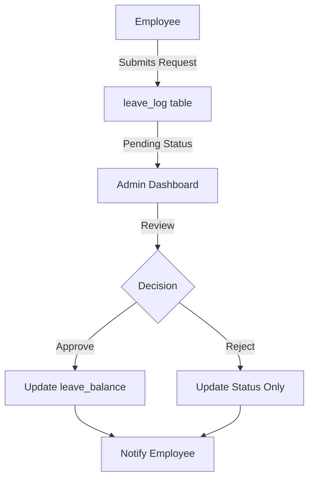

# Leave Management System - Technical Documentation

## System Architecture

### Overview
The Leave Management System is built on a three-tier architecture:
1. Presentation Layer (Frontend)
2. Application Layer (Backend APIs)
3. Data Layer (MySQL Database)

### Directory Structure
```
leaveSystem/
├── index.html           # Home/Landing page
├── login.html          # Login page
├── register.html       # Registration page
├── api/               # Backend API endpoints
│   ├── config.php    # Database configuration
│   ├── auth/         # Authentication APIs
│   │   ├── login.php
│   │   ├── logout.php
│   │   └── register.php
│   ├── get_employees.php
│   ├── get_leave_requests.php
│   └── update_leave_request.php
├── dashboard/        # Frontend pages
│   ├── adminDash.html     # Admin dashboard
│   ├── employeeDash.html  # Employee dashboard
│   └── templates/         # Reusable UI components
│       ├── header.html
│       ├── footer.html
│       ├── sidebar.html
│       ├── employee-management.html
│       └── leave-management.html
├── assets/          # Static resources
│   ├── css/
│   │   ├── style.css
│   │   ├── login.css
│   │   └── dashboard.css
│   ├── js/
│   │   ├── auth.js
│   │   ├── dashboard.js
│   │   └── api.js
│   └── images/
└── database/       # Database scripts
    └── leavems.sql
```

## Role-Based Authentication System

### User Roles
1. Admin
   - Full system access
   - Employee management
   - Leave request processing
   - System configuration

2. Employee
   - Personal dashboard
   - Leave requests
   - Profile management
   - Leave history

### Database Structure
```sql
CREATE TABLE `user_credentials` (
  `user_id` int(11) NOT NULL AUTO_INCREMENT,
  `employee_id` int(11) NOT NULL,
  `username` varchar(50) NOT NULL,
  `password` varchar(255) NOT NULL,
  `role` enum('admin','employee') NOT NULL DEFAULT 'employee',
  `last_login` timestamp NULL DEFAULT NULL,
  `status` enum('active','inactive') DEFAULT 'active',
  PRIMARY KEY (`user_id`),
  UNIQUE KEY `username` (`username`),
  KEY `employee_id` (`employee_id`),
  FOREIGN KEY (`employee_id`) REFERENCES `employee_details` (`employee_id`)
) ENGINE=InnoDB DEFAULT CHARSET=utf8mb4;
```

### Authentication Flow
1. User Access
   ```mermaid
   graph TD
       A[User] -->|Visits| B[index.html]
       B -->|Login| C[login.html]
       C -->|Submit| D[auth/login.php]
       D -->|Validate| E{Check Role}
       E -->|Admin| F[adminDash.html]
       E -->|Employee| G[employeeDash.html]
   ```

2. Login Process
   - Username/password validation
   - Role verification
   - Session creation
   - Redirect to appropriate dashboard

3. Session Management
   ```php
   // Session structure
   $_SESSION['user'] = [
       'employee_id' => $employee_id,
       'role' => $role,
       'name' => $name,
       'last_login' => $last_login
   ];
   ```

### Security Implementation
1. Password Security
   ```php
   // Password hashing
   $hashed_password = password_hash($password, PASSWORD_DEFAULT);
   
   // Password verification
   if (password_verify($password, $stored_hash)) {
       // Login success
   }
   ```

2. Session Protection
   - CSRF tokens
   - Session timeout
   - Secure cookie settings
   - XSS prevention

### Access Control
```php
// Role check middleware
function checkAdminAccess() {
    if (!isset($_SESSION['user']) || $_SESSION['user']['role'] !== 'admin') {
        header('Location: ../login.html');
        exit();
    }
}
```

## Frontend Components

### 1. Landing Page (index.html)
- System introduction
- Login/Register links
- Feature highlights
- Contact information

### 2. Login Page (login.html)
- Login form
- Role selection
- Password reset link
- Registration link

### 3. Dashboard Components
1. Admin Dashboard
   - Navigation sidebar
   - Quick statistics
   - Recent activities
   - System alerts

2. Employee Dashboard
   - Leave balance display
   - Quick leave request
   - Recent applications
   - Profile section

### JavaScript Implementation
```javascript
// Role-based redirect
function handleLogin(credentials) {
    try {
        const response = await fetch('../api/auth/login.php', {
            method: 'POST',
            headers: { 'Content-Type': 'application/json' },
            body: JSON.stringify(credentials)
        });
        
        const data = await response.json();
        
        if (data.status) {
            // Store user data
            localStorage.setItem('user', JSON.stringify(data.user));
            
            // Role-based redirect
            window.location.href = data.user.role === 'admin' 
                ? './dashboard/adminDash.html' 
                : './dashboard/employeeDash.html';
        }
    } catch (error) {
        console.error('Login failed:', error);
    }
}

// Session check
function checkSession() {
    const user = JSON.parse(localStorage.getItem('user'));
    if (!user) {
        window.location.href = '../login.html';
        return;
    }
    return user;
}
```

### CSS Styling
```css
/* Role-based styling */
.admin-only {
    display: none;
}

body[data-role="admin"] .admin-only {
    display: block;
}

/* Dashboard layout */
.dashboard-container {
    display: grid;
    grid-template-columns: 250px 1fr;
    min-height: 100vh;
}
```

## Workflow Documentation

### 1. Authentication Flow
1. User accesses the system
2. Enters credentials
3. System validates against user_credentials table
4. Creates session with user role and employee_id
5. Redirects to appropriate dashboard

### 2. Leave Request Process


#### Steps:
1. Employee submits leave request
   - Validates leave balance
   - Checks date conflicts
   - Creates entry in leave_log

2. Admin processes request
   - Views request details
   - Can add notes
   - Makes decision

3. System updates
   - Updates leave_log status
   - Adjusts leave_balance if approved
   - Records admin notes

### 3. Leave Balance Management

#### Initial Setup
- New employees get default leave allocation
- Balance recorded in leave_balance table
- Different types: sick, casual, earned, festival

#### Balance Updates
- Automatic deduction on leave approval
- Prevents negative balance
- Updates total_leave_left field

## Database Relationships

### Entity Relationship Diagram
```
employee_details 1--* leave_log
employee_details 1--1 leave_balance
employee_details 1--1 user_credentials
```

### Key Relationships
1. employee_details ↔ leave_log
   - One employee can have multiple leave requests
   - Each leave request belongs to one employee

2. employee_details ↔ leave_balance
   - One employee has one leave balance record
   - Balance updated based on leave approvals

## API Documentation

### 1. Employee Management APIs

#### Get Employees
```http
GET /api/get_employees.php
Response:
{
    "status": true,
    "data": {
        "employees": [
            {
                "employee_id": 1,
                "name": "John Doe",
                "email": "john@example.com",
                "department": "IT",
                "status": "active"
            }
        ]
    }
}
```

#### Get Leave Requests
```http
POST /api/get_leave_requests.php
Body: {
    "admin_id": 1,
    "status": "pending"
}
Response:
{
    "status": true,
    "data": {
        "requests": [
            {
                "leave_log_id": 1,
                "employee_name": "John Doe",
                "leave_type": "Sick Leave",
                "from_date": "2024-01-01",
                "to_date": "2024-01-02",
                "days": 2,
                "reason": "Medical appointment",
                "status": "Pending"
            }
        ]
    }
}
```

## Frontend Components

### 1. Admin Dashboard
- Navigation sidebar
- Statistics overview
- Employee management section
- Leave request processing
- Filter and search capabilities

### 2. Leave Management Interface
```javascript
// Key Functions
async function loadLeaveRequests() {
    // Fetches and displays leave requests
}

async function handleLeaveAction(requestId, action, note) {
    // Processes leave requests with notes
}

function showNoteModal(requestId, action) {
    // Displays note input modal
}
```

## Security Implementations

### 1. Data Protection
- Prepared statements for SQL
- Input sanitization
- XSS prevention
- CSRF protection

### 2. Access Control
- Role-based permissions
- Session management
- Secure password storage
- Activity logging

## Error Handling

### 1. API Responses
- Standardized error format
- Detailed error messages
- Status codes
- Error logging

### 2. Frontend Validation
- Form input validation
- Date range checks
- Balance validation
- User feedback

## Testing Guidelines

### 1. API Testing
- Endpoint functionality
- Error scenarios
- Data validation
- Response format

### 2. Frontend Testing
- UI components
- User workflows
- Cross-browser compatibility
- Responsive design

## Maintenance Procedures

### 1. Database Maintenance
- Regular backups
- Index optimization
- Query optimization
- Data cleanup

### 2. System Updates
- Version control
- Change documentation
- Update procedures
- Rollback plans

## Troubleshooting Guide

### Common Issues
1. Leave Balance Errors
   - Check leave_balance table
   - Verify calculation logic
   - Check transaction logs

2. Authentication Issues
   - Verify session data
   - Check user credentials
   - Clear browser cache

3. API Errors
   - Check error logs
   - Verify request format
   - Check database connection

## Performance Optimization

### 1. Database Optimization
- Proper indexing
- Query optimization
- Connection pooling
- Regular maintenance

### 2. Frontend Optimization
- Code minification
- Asset compression
- Lazy loading
- Caching strategies

## Deployment Guide

### 1. Prerequisites
- PHP 7.4+
- MySQL 5.7+
- Web server (Apache/Nginx)
- SSL certificate

### 2. Installation Steps
1. Database setup
2. Configuration
3. File permissions
4. Security checks

## Support and Maintenance

### 1. Regular Tasks
- Database backups
- Log rotation
- Security updates
- Performance monitoring

### 2. Emergency Procedures
- System recovery
- Data restoration
- Issue escalation
- Emergency contacts

## Version History

### Current Version: 1.0
- Initial release
- Basic leave management
- Employee and admin interfaces
- Leave request processing

### Planned Updates
1. Version 1.1
   - Email notifications
   - Document attachments
   - Advanced reporting

2. Version 1.2
   - Mobile app integration
   - Advanced analytics
   - Bulk processing
